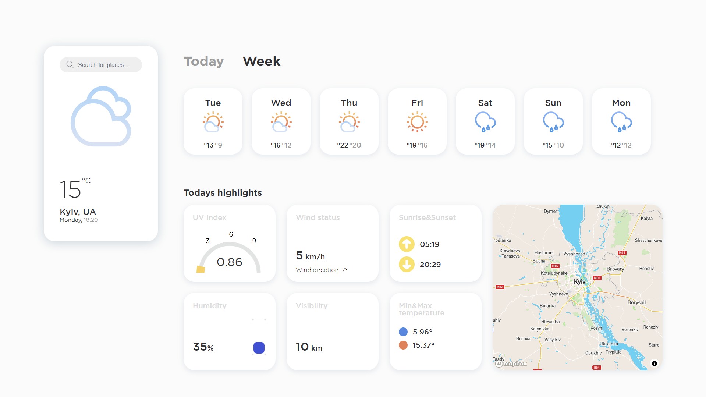

<br />
<div  align="center">

</a>
<h3  align="center"> Weather application</h3>
</div>

<!-- TABLE OF CONTENTS -->
## About The Project

Hi! It's my pet-project. I made this for practice TypeScript language and Vue Composition API. The design for this application was created by me in Figma but I was inspired by <a  href="https://habr.com/ru/post/543750/">this</a> :ok_hand:.

<p  align="right">(<a  href="#top">back to top</a>)</p>


### Built With

* [Vue.js](https://vuejs.org/)
* [Mapbox](https://www.mapbox.com/)
* [TypeScript](https://www.typescriptlang.org/)
* [MomentJS](https://momentjs.com/)

<p  align="right">(<a  href="#top">back to top</a>)</p>

<!-- GETTING STARTED -->

## Getting Started

  
### Installation

1. Get a free API Key at [https://openweathermap.org/](https://openweathermap.org/)
2. Get a free API Key at [https://www.mapbox.com/](https://www.mapbox.com/)

3. Clone the repo

```sh
git clone https://github.com/VladKoroliuk/weather-app.git
```

4. Install NPM packages

```sh
npm install
```

5. You must to add following .env variables:

```env
VUE_APP_API_URL = SERVER URL

VUE_APP_API_KEY = OPEN WEATHER API KEY

VUE_APP_MAPBOX_API_KEY = MAPBOX API KEY
```
<p align="right">(<a href="#top">back to top</a>)</p>


<!-- CONTACT -->

## Contact

Vlad Koroliuk - koroliuk.work@gmail.com
Project Link: [https://github.com/VladKoroliuk/weather-app](https://github.com/VladKoroliuk/weather-app)]
<p align="right">(<a href="#top">back to top</a>)</p>